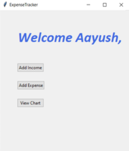
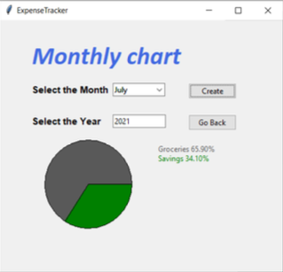
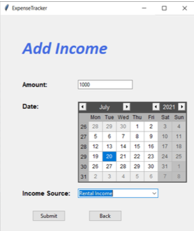
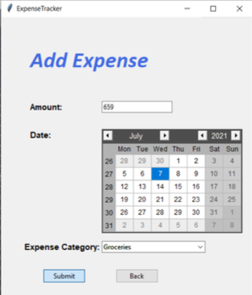
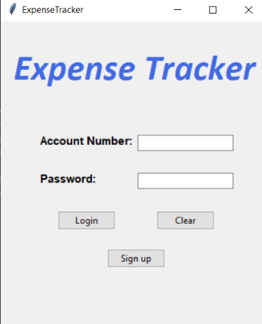

Install these libraries
1. pip install mysql-connector-python
2. pip install tkcalendar
3. create a database name 'expensetracker' in the xampp server
4. import the file 'expensetracker.sql' in the expensetracker database that is created in the 3rd step
5. Execute the file main.py

